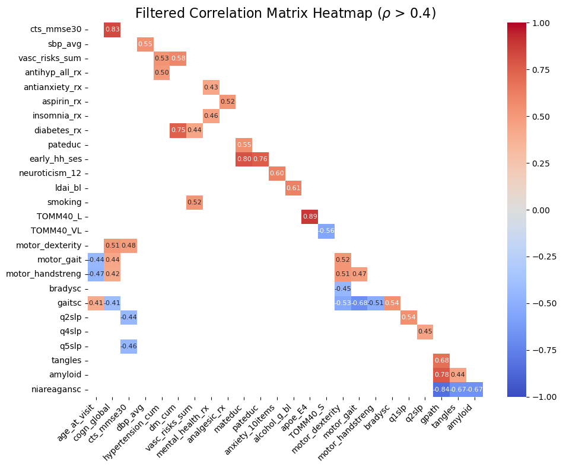
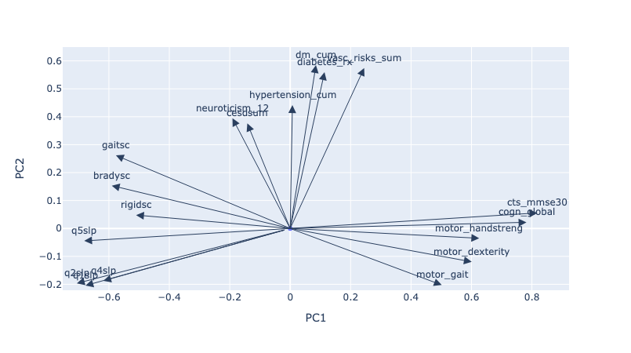
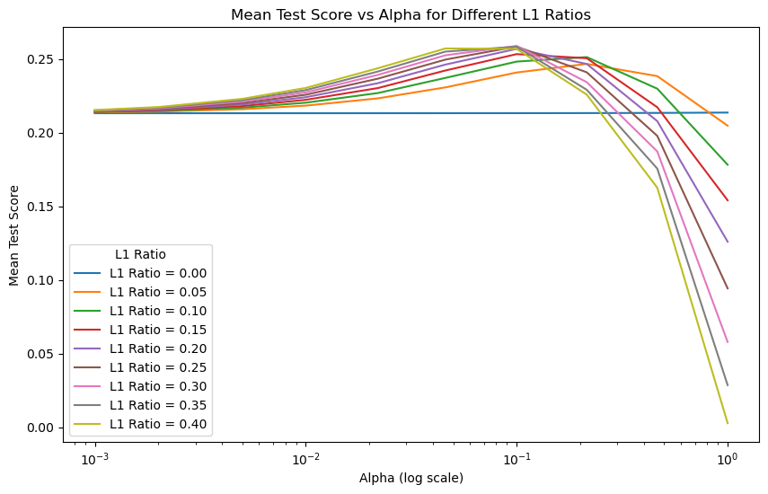

# Background

Alzheimer's disease (AD) pathology begins years before clinical symptoms appear, offering a crucial window for early intervention. Predicting brain pathology using clinical features could enable timely interventions to potentially slow or prevent cognitive decline.

## Data

The study uses data from the ROS/MAP cohort, which includes approximately 3,700 participants who were free of dementia at baseline and followed annually. 
- **Features:** Collected clinical features include cognitive test scores, underlying health conditions, and demographic variables.
- **Outcome:** Pathology profiling includes:
  - Amyloid
  - Tangles
  - Gpath
  - NIA-Reagan scores

## Goal

The goal of this study is to utilize longitudinal clinical data from the ROS/MAP study to develop a model that predicts brain pathology based on clinical features.


## Method
The analysis consists of the following steps:

1. **Data Exploration and  Preparation:**
See full scripts for data exploration and preparation [here](https://nbviewer.org/github/daiqile96/AD_Pathology_Prediction/blob/main/data_prep.ipynb).
   - Performed correlation analysis to check correlation among features and outcomes.
   - Split the data into 80% training and 20% testing sets.
   - Scaled features to ensure compatibility with the regression model.

2. **Baseline Model: Elastic Net Regression:**
A generalized linear model (GLM) with Elastic Net regularization was developed using clinical features from participants' last visits to predict brain pathology. This serves as the baseline for comparison. See full scripts for baseline model [here](https://nbviewer.org/github/daiqile96/AD_Pathology_Prediction/blob/main/elastic_net.ipynb).
   - **Hyperparameter Tuning:** Employed GridSearchCV to optimize hyperparameters.
   - **Model Fitting:** Trained the model with the best parameters identified through tuning.
   - **Evaluation:** Evaluated model performance on the testing dataset.

3. **LSTM**:
An LSTM (Long Short-Term Memory) model was developed to leverage the full longitudinal data. The LSTM's performance was compared to the baseline GLM model to evaluate its effectiveness in capturing temporal patterns.
    - **Hyperparameter Tuning uisng Cross-validation:** Employed 5-fold cross-validation to optimize hyperparameters. See scripts [here](https://github.com/daiqile96/AD_Pathology_Prediction/blob/main/lstm_cross_validation.py).
      - We considered the following hyperparameters:
        - Hidden Size: {4, 8, 16, 32} 
        - Number of Layers: {1, 2, 3, 4}
        - Learning Rate: {0.001, 0.005, 0.01}
        - Batch Size: {16, 32, 64} 
        - Dropout Rate: {0, 0.2, 0.4, 0.5}
      - During hyperparameter tuning, we also considered models with different outcome variable combinations:
        - Single outcomes: ['gpath'], ['tangles']
        - Pairwise outcomes: ['gpath', 'tangles']
        - Three outcomes: ['gpath', 'tangles', 'amyloid']，['gpath', 'tangles', 'niareagansc']
        - All outcomes: , ['gpath', 'tangles', 'amyloid', 'niareagansc']
    - **Select hyperparameters and outcome variables**: After cross-validation, for each outcome variable combination, we selected the best hyperparameter with highest average cross-validation prediction $R^2$, and then evaluate the selected model in testing samples. See scripts [here](https://github.com/daiqile96/AD_Pathology_Prediction/blob/main/lstm_testing_performance.py). 
      - The script outputs [target_set_performance.csv](https://github.com/daiqile96/AD_Pathology_Prediction/blob/main/target_set_performance.csv) which contains the testing $R^2$ for each selected model. Based on these results, we identified the **final model with the highest testing $R^2$ for gpath and tangles**:
        - gpath: 
          - hyperparameter: hidden_size=16, num_layers=3, batch_size=16, learning_rate=0.01, dropout_rate=0
          - outcome variables: ['gpath', 'tangles', 'amyloid', 'niareagansc']
        - tangles: 
          - hidden_size=16, num_layers=1, batch_size=32, learning_rate=0.01
            - since num_layers=1, the dropout rate is not applicable.
          - outcome variable: ['tangles']
      - We further checked the training and validation loss of the final model. See results [here](https://nbviewer.org/github/daiqile96/AD_Pathology_Prediction/blob/main/lstm_final_model.ipynb).
        


```


## Results
### Correlation between features and outcomes
To better understand the relationships among features, a filtered correlation matrix was generated, showing only correlations with an absolute value greater than 0.4:



### PCA Analysis and Loadings
Principal Component Analysis (PCA) was applied to reduce the dimensionality of the feature set. Below is the visualization of PCA loadings, showing how features contribute to the first two principal components. Only features with loadings > 0.4 were shown in the figure.



- Strong Contributors to PC1: 
  - Features like cts_mmse30, motor_handstreng, motor_dexterity, and motor_gait have high positive loadings on PC1. This suggests that PC1 likely represents motor and cognitive function metrics, as these features are related to mobility and cognitive assessment.
- Strong Contributors to PC2: 
  - Features such as dm_cum, diabetes, fx_risks_sum, and hypertension_cum have high positive loadings on PC2. This indicates that PC2 may capture health-related risk factors, such as cumulative diabetes and hypertension effects.


### Elastic Net Regression with PCA (20 Principal Components)
Elastic Net Regression was performed using the 20 principal components derived from PCA. 
- **Model Performance:**
  - **R-squared on Test Data:** 0.1914

### Elastic Net Regression with Raw Features

- The optimal parameters for predicting **Gpath** were selected using GridSearchCV:
  - **Alpha:** 0.1
  - **L1 Ratio:** 0.3
- The following plot visualizes the hyperparameter tuning:
  

- **Model Performance:**
  - **R-squared on Test Data**:0.2619
  

